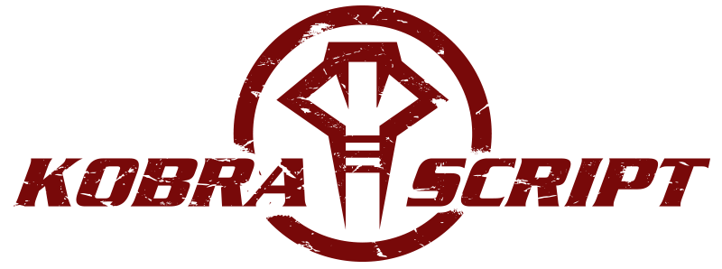

  

==============
KobraScript is a language that harvests the power of JavaScript with an incredibly intuitive syntax.

#### Kobra Demands Respect (Hello, world!)
Say my name...

    say("Kobra!")                                           console.log("Kobra!");

#### Variable Declarations
In KobraScript, variable declarations are simplified to one character: `$`.

    $ name = "Samson"                                       var name = "Samson";

    $ likesMusic = true,                                    var likesMusic = true,
      likesJazz = true                                          likesJazz;

    $ isRed = true,                                         var isRed = true,
      isFood = false,                                          isFood = false,
      isMine = true                                            isMine = true;

Variables with uninitialized values are set to undefined.

    $ total                                                 var total = undefined;

#### Functions
Functions in KobraScript are declared with `fn`, with open with `:` and close with `end`, or `..` if declared consecutively.

    fn average_intake (x):                                  function averageIntake (x) {
        $ total = 0                                             var total = 0;
        for ($ i = 0; i < x.length; i++):                       for (var i = 0; i < x.length; i++) {
            total = total + x[i]                                    total = total + x[i]
        end                                                     }
        say(total)                                              console.log(total)
        return total / x.length                                 return total / x.length
    end                                                     }
    
    $ getSoup = fn (): return Res.soupOfTheDay() ..,        var getSoup = function () {return Res.soupOfTheDay()},
      getDrink = fn (): return Res.specdrinks ..,               getDrink = function () {return Res.spacdrinks},
      placeOrder = fn (item, quantity):                         placeOrder = function (item, quantity) {
          Kitchen.addOrder(item, quantity)                          Kitchen.addOrder(item, quantity)
          return true                                               return true
      end                                                       };

A subroutine that does not return anything in KobraScript is called a procedure, written as `proc`. All other subroutines are functions, `fn`, and are expected to have a return statement.

    proc print_intake (y):                                  function printIntake (y) {
        say(average_intake(y))                                  console.log(averageIntake(y))
    end                                                     }

#### `if`-`else` Conditions
In KobraScript the `if`-`else` statement is written with a '..' between conditions and 'end' after the final block to signal the conclusion of the statement. Marvel in the beauty of the KobraScript.

    if (is_red && is_food):                                 if (is_red && is_food) {
        eat ()                                                  eat ();
    .. else if (is_food && is_mine):                        } else if (is_food && is_mine) {
        add_butter ()                                           add_butter ();
    .. else:                                                } else {
        keep ()                                                 keep();
    end                                                     }

#### `for` and `while` loops
For and while loops look as expected, using the `:` and `end` blocking syntax.

    $ a = 0 -- A test variable for loops.                   var a = 0; // A test variable for loops.

    for ($ i = 0; i < 4; i++):                              for (var i = 0; i < 4; i++) {
        a++                                                     a++;
    end                                                     }

    while (a < 10):                                         while (a < 10) {
        a++                                                     a++;
    end                                                     }

#### Objects
Objects are very similar in KobraScript to JavaScript. Braces are used specifically for objects, and nothing else. Properties in objects are assigned using the `:` with `,` delimiting declarations.

    $ bicycle = {                                           var bicycle = {
        frame: "aluminum",                                          frame: "aluminum",
        year: 2009,                                                 year: 2009,
        gears: 10,                                                  gears: 10,
        speed: 12.7,                                                speed: 12.7,                           
        move: proc ():                                              move: function () {
            Transform.translate(FORWARD * this.speed)                   Transform.translate(FORWARD * this.speed)
        ..,                                                         },
        upgrade_speed: fn ():                                       upgradeSpeed: function () {
            return this.speed = this.speed * 1.1                        return this.speed = this.speed * 1.1
        ..,                                                         },
        get_frame: fn (): return this.frame end                     getFrame: function () {return this.frame}
    }                                                       }

#### Blueprints
Blueprints are special structures in KobraScript. They allow for a robust way to define object properties and methods, and expediate the process of creating a complex object. Blueprints use a different file extension, `.ksb`, due to the fact that blueprints are individual files.

To utilize a blueprint in KobraScript, you "construct" the blueprint in a variable declaration, as you would an object in other languages. Parameters to construction can be specified specificly or dynamically. 
- Specific -> `construct Person (hairColor = "black")`
- Dynamic  -> `construct Person()` or `construct Person("Joe")`
    
    $ p1 = construct Person("Joe", 18)         var p1 = new Person("Joe", 18)
    $ p2 = construct Person(age = 18)          var p2 = new Person(undefined, 18)

Blueprints consists of 4 parts:

1. `has`
       * Specify Blueprint properties.
       * The `#` operator can be used to specify a default value.
            `haircolor = hairColor # "black"`
2. `does`
       * Specify Blueprint methods (functions).
       * Methods can be defined from parameters
            `do_exercise = exercise # running()`
3. `synget`, which allows `get_property()` functions to be created.
4. `synset`, which allows `set_property()` functions to be created.

Here is an example of a blueprint of a Person.  

    $ blueprint Person (name, age, hairColor, exercise)
    has:
        name: name,
        age: age,
        hairColor: hairColor # "black"
    
    does:
        do_exercise: exercise # running,
        running: proc ():
            say("26.2 miles")
        end
    
    synget:
        name, age, hairColor
    
    synset:
        hairColor

    defcc

#### Arrays    
    $ protein_intake = [12, 21.3, 7.2, 20]                  var protein_intake = [12.0, 21.3, 7.2, 20.0];
    $ enigma = [{code: '8878'}, [], false]                  var enigma = [{code: '8878'}, [], false]

### Macrosyntax

    /**
    * This is regarded as the the most up to date specification of KS
    * KobraScript Syntax v.1.4
    * 
    */

    UNIT    ::=  PROGRAM
            |    BLUPRNT

    PROGRAM ::=  BLOCK

    BLOCK   ::=  STMT+

    STMT    ::=  VARDEC
            |    FNDEC
            |    ASSIGN
            |    INCR
            |    'if'  '('  EXP  ')'  OPENBLK
                 ('..'  'else'  'if'  '('  EXP  ')'  OPENBLK)*
                 ('..'  'else'  '('  EXP  ')'  BLOCK)?  'end'
            |    'for'  '('  (VARDEC)?  ';'  EXP  ';'  INCREMENT  ')'  OPENBLK  'end'
            |    'while'  '('  EXP  ')'  OPENBLK  'end'
            |    'return'  EXP  OPENBLK  'end'

    VARDEC  ::=  '$'  ASSIGN  (','  ASSIGN)*
    FNDEC   ::=  FNTYPE  ID  PARAMS  OPENBLK  ('..' | 'end')
    FNTYPE  ::=  'proc' | 'fn'
    PARAMS  ::=  '('  ID  (','  ID)*  ')'

    ASSIGN  ::=  VAR  '=' EXP
            |    VAR  ':=:'  VAR
        
    INCR    ::=  VAR  "++" | "++"  VAR
            |    VAR  "--" | "--"  VAR
            |    VAR  "+="  INTLIT
            |    VAR  "-="  INTLIT
            |    VAR  "*="  INTLIT
            |    VAR  "%="  INTLIT
        
    OPENBLK ::=  ':'  BLOCK

    EXP     ::=  EXP1 (('||' | '#') EXP1)*
    EXP1    ::=  EXP2 ('&&' EXP2)*
    EXP2    ::=  EXP3 (('<' | '<=' | '==' | '~=' '!=' | '>=' | '>' | 'is') EXP3)?
    EXP3    ::=  EXP4 ([+-] EXP4)*
    EXP4    ::=  EXP5 ([%*/] EXP5)*
    EXP5    ::=  EXP6 (('**' | '-**')  EXP6)
    EXP6    ::=  ('~!' | '~?')?  EXP7
    EXP7    ::=  ('!')?  EXP8
    EXP8    ::=  'undefined' | 'null' | BOOLIT | STRLIT | NUMLIT | VAR |
            |    MAKE | FNVAL | OBJECT | '('  EXP  ')'

    VAR     ::=  ID SUFFIX*
    SUFFIX  ::=  '[' EXP ']'
            |    '.' ID
            |    '(' ARGS ')'

    MAKE    ::=  'construct'  ID  '('  ((ID  '='  EXP  ',')*  ID  '='  EXP | (ID  ',')*  ID)  ')'
    FNVAL   ::=  FNTYPE  PARAMS  OPENBLK  ('..' | 'end')
    FNCALL  ::=  VAR  ARGS
    ARGS    ::=  '('  EXP  (','  EXP)*  ')'

    OBJECT  ::=  '{'  (PRPRTY  (','  PRPTRY)*)?  '}'
    PRPRTY  ::=  ID  ':'  EXP

    BLUPRNT ::=  'blueprint'  ID  PARAMS  BLUBLK  'defcc'
    BLUBLK  ::=  ':'  HASBLK  DOESBLK  ((SYNGET?  SYNSET?) | (SYNSET?  SYNGET?))
    HASBLK  ::=  'has'  ':'  VARDEC?
    DOESBLK ::=  'does'  ':'  FNDEC?
    SYNGET  ::=  'synget'  ':'  (ID  ',')*  ID
    SYNSET  ::=  'synset'  ':'  (ID  ',')*  ID

    ### Microsyntax

    BITS    ->  [01]*
    INT     ->  -?[\d]*
    FLOAT   ->  INT.\d*
    HEX     ->  (\d | [a-f] | [A-F])*
    STR     ->  '\w+'
    BOOL    ->  'true' | 'false'
    ID      ->  [_a-zA-Z]\w*
    COMMENT ->  '>>'  TEXT
            |   '>|'  TEXT  '|<'